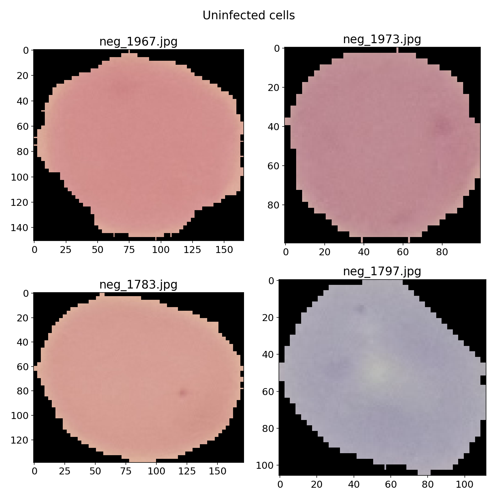
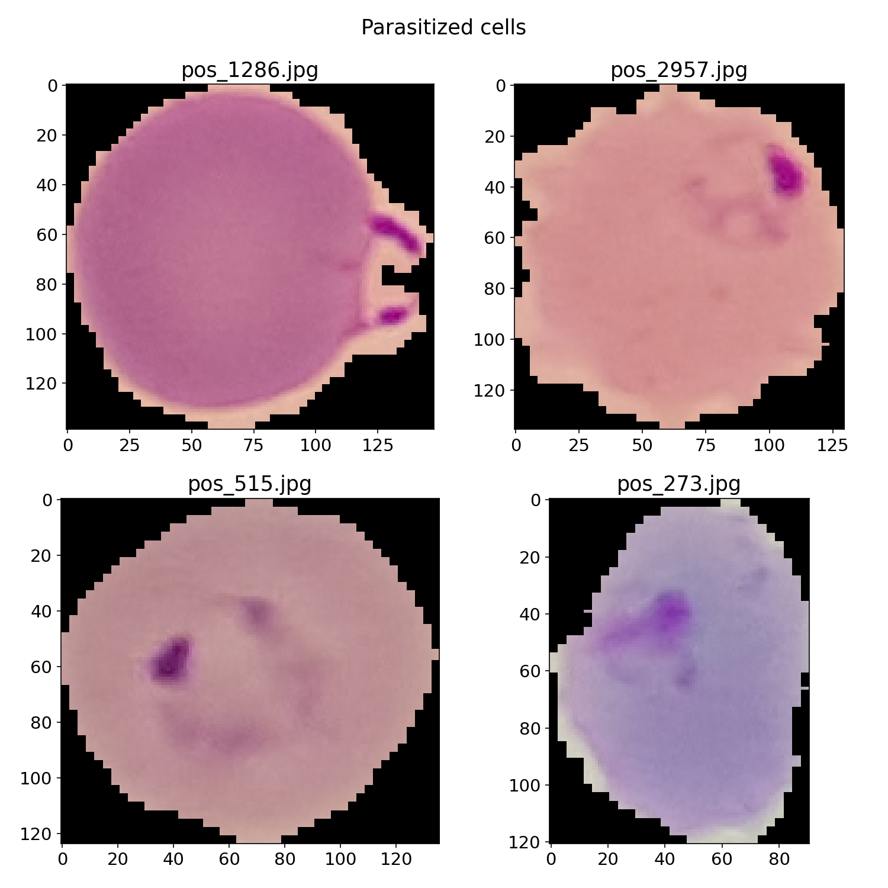
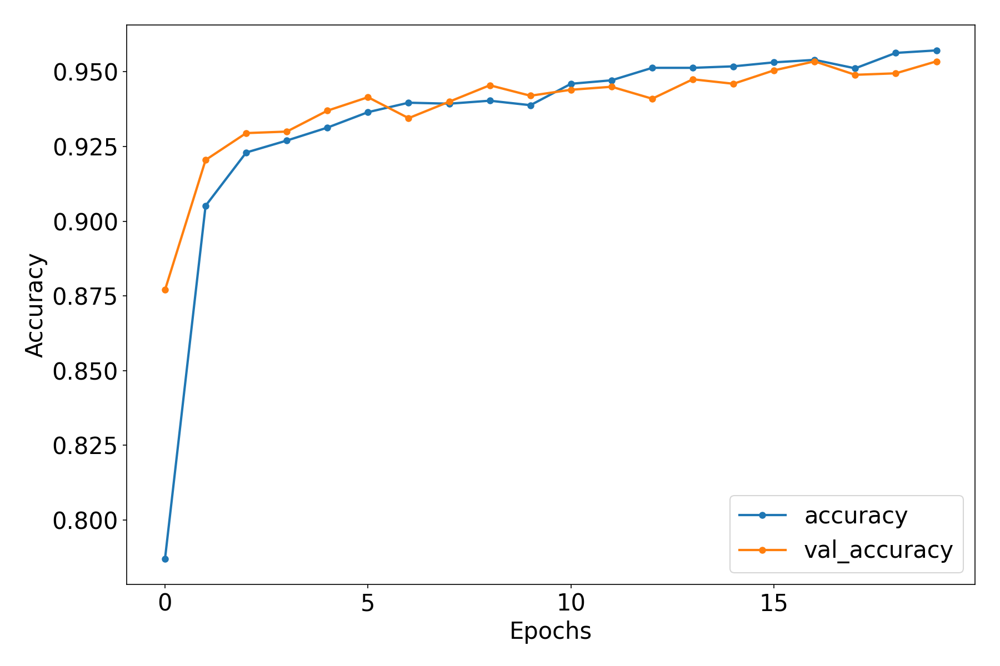
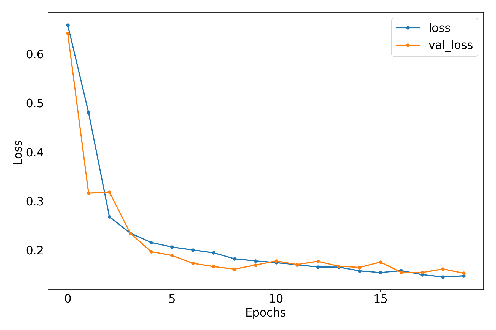
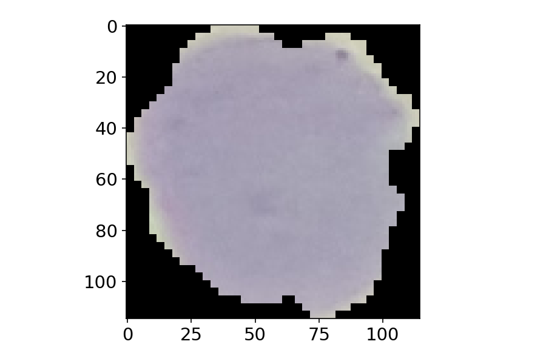
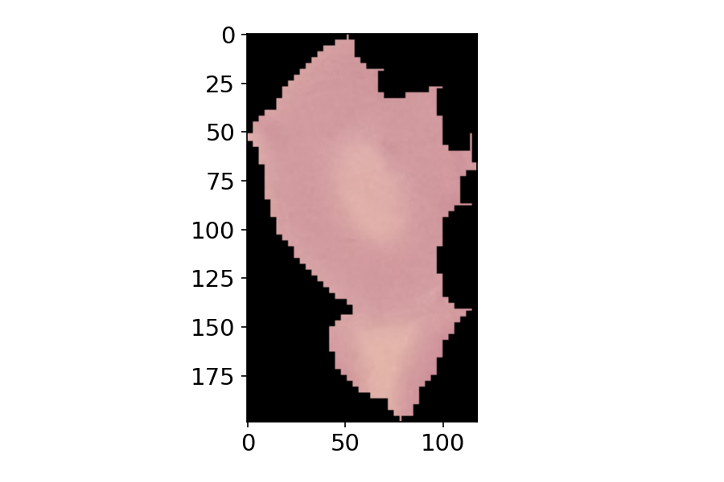
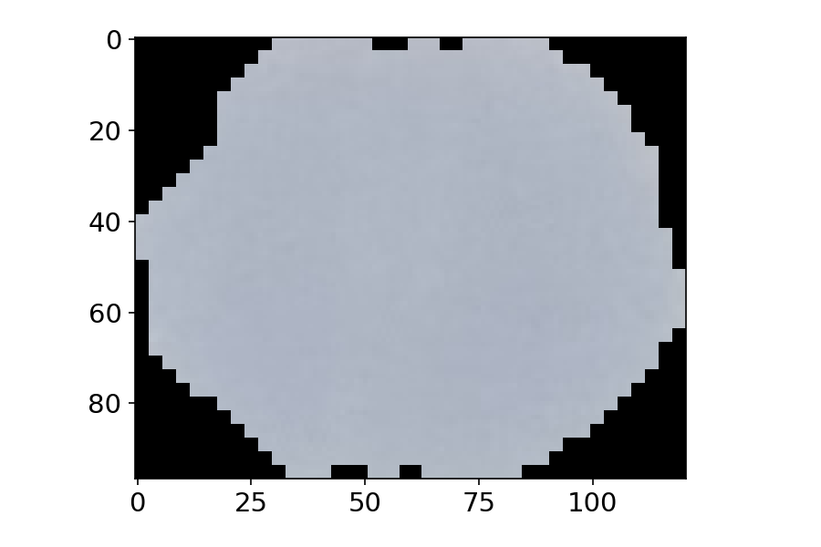
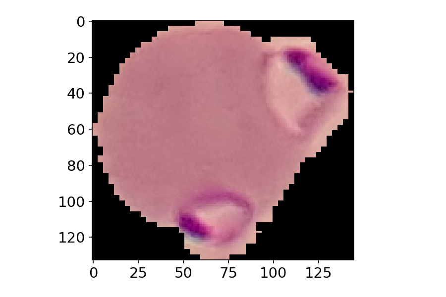
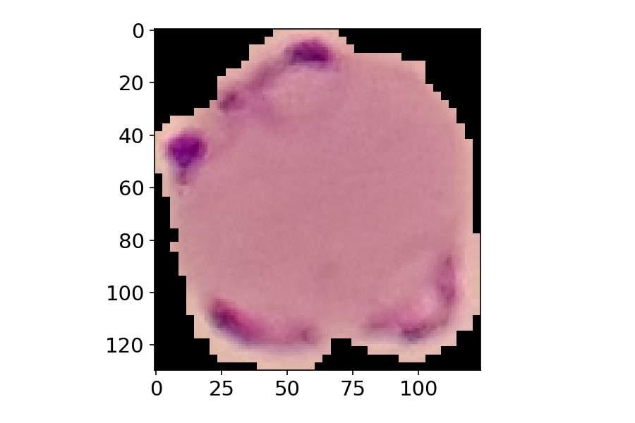
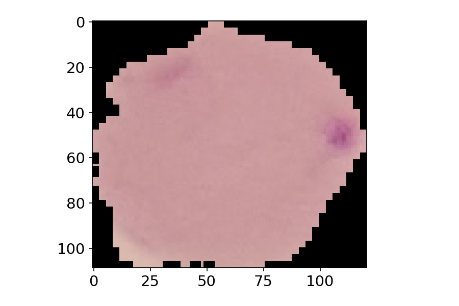

- [Malaria Cell image detection by Tensorflow](#malaria-cell-image-detection-by-tensorflow)
- [Model creation](#model-creation)
  - [Training and validation accuracy with epoch](#training-and-validation-accuracy-with-epoch)
  - [Training and validation loss with epoch](#training-and-validation-loss-with-epoch)
- [Testing](#testing)
- [Conclusion](#conclusion)
- [Acknowledgements](#acknowledgements)


# Malaria Cell image detection by Tensorflow

The original data set contains 27558 images. 

Half of them are infected and the other half are uninfected.

Some uninfected cells:


and 

infected cells:



For faster computation I have selected a subset of images.
Then the cells are divided to the following directories for training, validation and testing.

- Train
  - pos (3000)
  - neg (3000)  
<br>

- Validation
  - pos (1000)
  - neg (1000)

<br> 

- Test (1000 mixed 500 pos and 500 neg)


# Model creation
```
model = Sequential()
model.add(Conv2D(filters = 16, 
                 kernel_size=2,
                 padding = 'same',
                 activation = 'relu',input_shape = (128,128,3)))

model.add(MaxPool2D(pool_size = 2))
model.add(Conv2D(filters = 32,
                kernel_size=2,
                padding='same',
                activation='relu'))
model.add(MaxPool2D(pool_size = 2))
model.add(Conv2D(filters = 64,
                kernel_size=2,
                padding='same',
                activation='relu'))
model.add(MaxPool2D(pool_size = 2))

model.add(Flatten())
model.add(Dense(64,activation='relu'))

model.add(Dense(1,activation='sigmoid'))
model.summary()

model.compile(loss='binary_crossentropy',
              optimizer = 'adam',
             metrics=['accuracy'])

```

## Training and validation accuracy with epoch


<br>

## Training and validation loss with epoch



# Testing

Lets test some of the positive and negative images from test dataset.  
**Image: neg_4001.jpg**


results:

    Predicted Probability 0.067685485
    Predicted class "neg"

<br>

**Image: neg_4002.jpg**



results:

    Predicted Probability 0.025765091
    Predicted class "neg"

<br>

**Image: neg_4003.jpg**



results:

    Predicted Probability 0.066964716
    Predicted class "neg"

<br>

**Image: pos_4498.jpg**



results:

    Predicted Probability 0.9999056
    Predicted class "pos"

<br>

**Image: pos_4499.jpg**



results:

    Predicted Probability 0.9999994
    Predicted class "pos"


<br>

**Image: pos_4500.jpg**



results:

    Predicted Probability 0.8576803
    Predicted class "pos"


# Conclusion
- successfully created tensorflow model with accuracy over 95% .


# Acknowledgements

The dataset used for this project is taken from the Official NIH website.
https://lhncbc.nlm.nih.gov/LHC-research/image-processing.html
